# shinymaker

### 概要 

- shinyアプリの雛形ファイルを作成するためのshinyアプリです。

### ダウンロード 

- gitを使用していない場合は、zipファイルをダウンロードして使用してください。

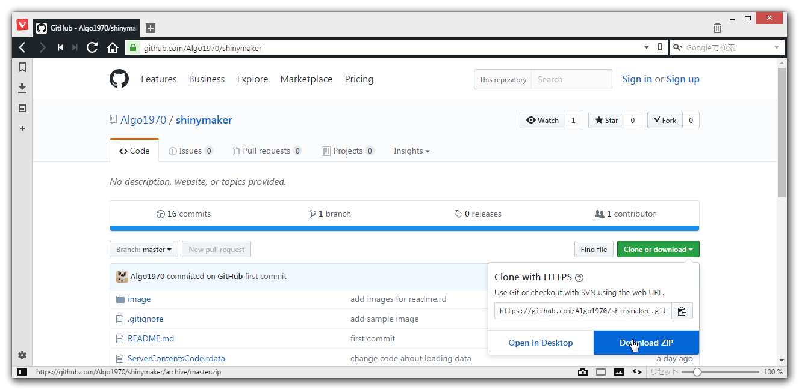

- gitを使用している場合は、下記でgit cloneして使用して下さい。

```
git clone https://github.com/Algo1970/shinymaker.git
```

### 使用法 

1. ダウンロード後、Rstudioからshinymakerフォルダのshinymakerプロジェクトを開いて下さい。
次にshinymaker.Rを実行します。shinymaker.R自体がshinyアプリですので、Run Appボタンを押して実行して下さい。
下記画面が表示されれば、OKです。

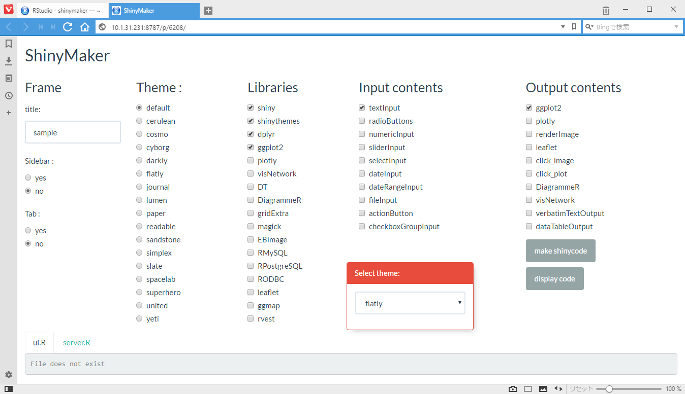

2. 必要があればtitile名を入力し、Sidebar、Tabの有無にチェックを付けて下さい。

3. Select themeウインドウで使用するテーマを確認し、Themeにチェックを入れます。

4. 次に使用したいlibraryをチェックします。

5. Input contentsには、私がよく使用するInputUIのみ入っています。

6. Output contentsから使用したい内容を選択して下さい。

コードを簡単にするため（面倒だったから？）、libraryとOutputo contentsの内容とはリンクしておりません。
コンテンツでggplot2使用する際には、手動でlibraryのggplot2にチェックを入れて下さい。

7. shinyコードを作成します。右下のmake shinyボタンを押して下さい。ワーキングディレクトリにshinyアプリ(ui.r/server.r)の入ったsampleフォルダが作成されます。

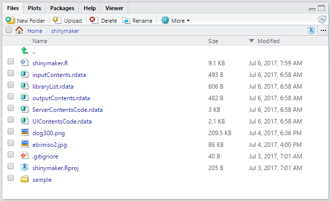

フォルダの中にui.Rとserver.Rファイルが作成されています。

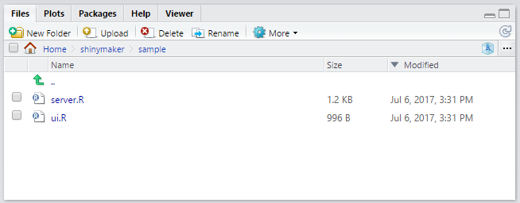

8. どのようなコードが作成されたかは、display codeボタンを押すと、タブ内にコードが表示されます。

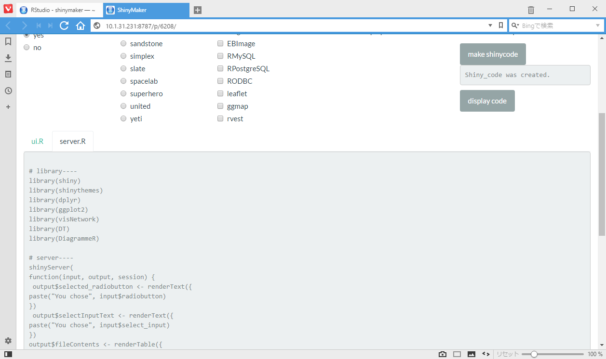


作成されたコードはインデントが調整されておりませんので、Rstudioのショートカット(ctrl+A  →　ctrl+I)でインデントを付けてデバッグ等行うと良いと思います。

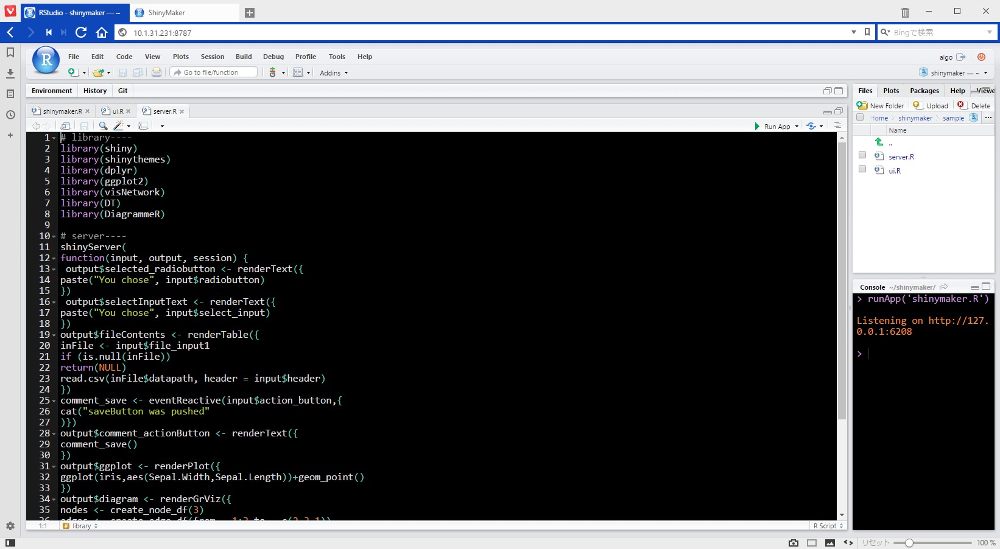

- Ctrl + A

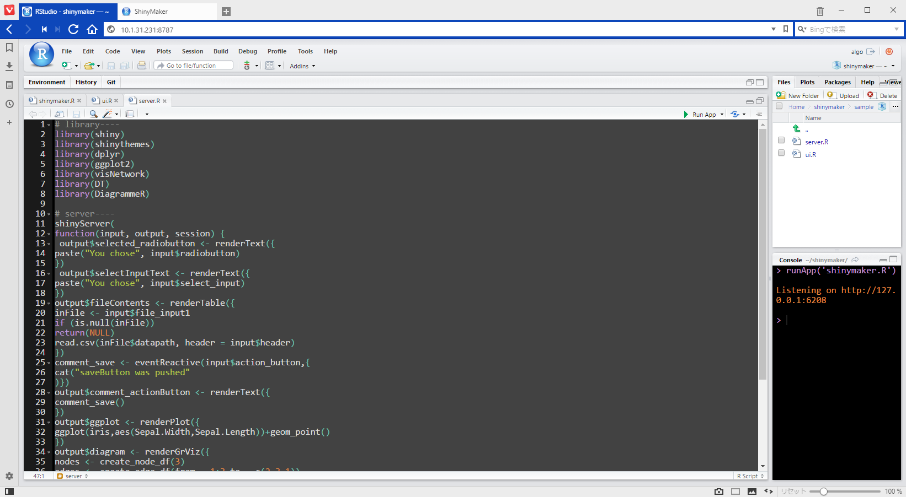

- Ctrl + I

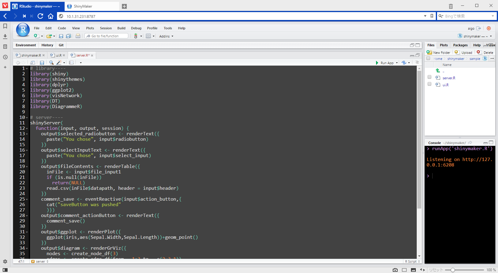


9. 作成されたshinyアプリを実行してみましょう。

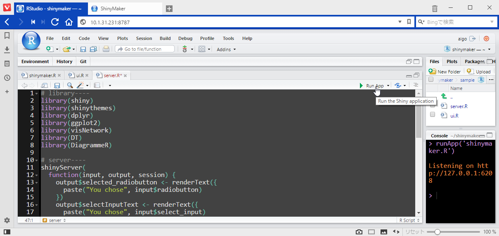

RunAppボタンを押して実行します。

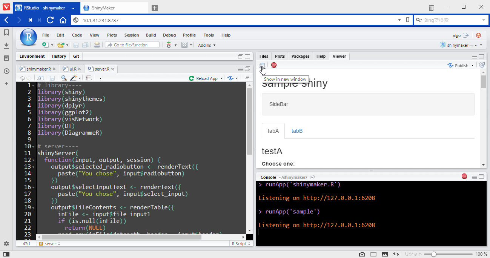

Viewer内に表示されたら、Show in New Windowボタンを押してください。

Webブラウザで立ち上がりました。
これができあがったshinyアプリです。

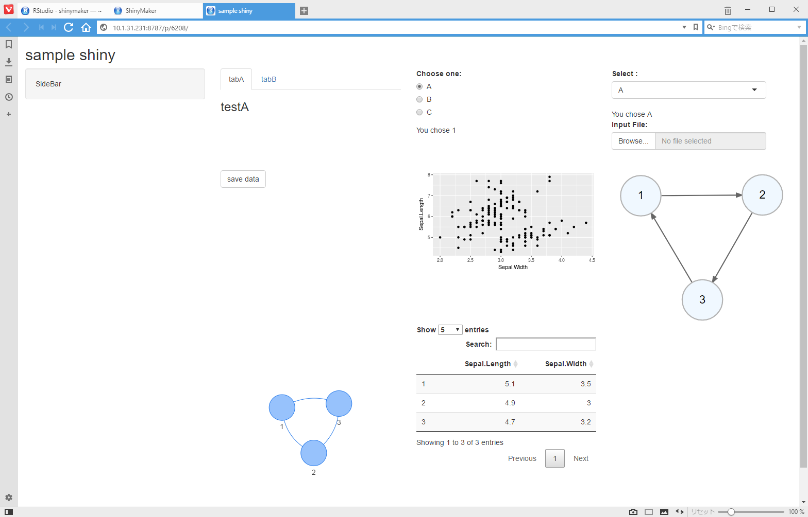

shinyアプリのパーツが並んでいるので、コードを少し変更するだけでアプリを仕上げることができます。
アプリ作成時間が、かなり短縮できると思いますので試してみて下さい。


### 使用環境

```
> sessionInfo()
R version 3.4.0 (2017-04-21)
Platform: x86_64-pc-linux-gnu (64-bit)
Running under: Ubuntu 16.04.2 LTS

Matrix products: default
BLAS: /usr/lib/libblas/libblas.so.3.6.0
LAPACK: /usr/lib/lapack/liblapack.so.3.6.0

locale:
 [1] LC_CTYPE=ja_JP.UTF-8       LC_NUMERIC=C              
 [3] LC_TIME=ja_JP.UTF-8        LC_COLLATE=ja_JP.UTF-8    
 [5] LC_MONETARY=ja_JP.UTF-8    LC_MESSAGES=ja_JP.UTF-8   
 [7] LC_PAPER=ja_JP.UTF-8       LC_NAME=C                 
 [9] LC_ADDRESS=C               LC_TELEPHONE=C            
[11] LC_MEASUREMENT=ja_JP.UTF-8 LC_IDENTIFICATION=C       

attached base packages:
[1] stats     graphics  grDevices utils     datasets  methods   base     

other attached packages:
 [1] leaflet_1.1.0     RODBC_1.3-15      EBImage_4.18.0    magick_0.4       
 [5] gridExtra_2.2.1   DT_0.2            plotly_4.7.0      clipr_0.3.2      
 [9] DiagrammeR_0.9.1  visNetwork_1.0.3  ggplot2_2.2.1     dplyr_0.5.0      
[13] shinythemes_1.1.1 shiny_1.0.3      

loaded via a namespace (and not attached):
 [1] Rcpp_0.12.10        locfit_1.5-9.1      lattice_0.20-35    
 [4] tidyr_0.6.3         fftwtools_0.9-8     png_0.1-7          
 [7] assertthat_0.2.0    rprojroot_1.2       digest_0.6.12      
[10] mime_0.5            R6_2.2.1            tiff_0.1-5         
[13] plyr_1.8.4          backports_1.0.5     evaluate_0.10      
[16] httr_1.2.1          rlang_0.1.1         lazyeval_0.2.0     
[19] rstudioapi_0.6      rmarkdown_1.5       labeling_0.3       
[22] downloader_0.4      readr_1.1.1         stringr_1.2.0      
[25] htmlwidgets_0.8     igraph_1.0.1        munsell_0.4.3      
[28] compiler_3.4.0      influenceR_0.1.0    rgexf_0.15.3       
[31] httpuv_1.3.3        BiocGenerics_0.22.0 htmltools_0.3.6    
[34] tibble_1.3.1        XML_3.98-1.7        viridisLite_0.2.0  
[37] grid_3.4.0          jsonlite_1.5        xtable_1.8-2       
[40] gtable_0.2.0        DBI_0.6-1           magrittr_1.5       
[43] scales_0.4.1        stringi_1.1.5       viridis_0.4.0      
[46] brew_1.0-6          RColorBrewer_1.1-2  tools_3.4.0        
[49] purrr_0.2.2.2       hms_0.3             crosstalk_1.0.0    
[52] jpeg_0.1-8          Rook_1.1-1          rsconnect_0.8      
[55] abind_1.4-5         parallel_3.4.0      yaml_2.1.14        
[58] colorspace_1.3-2    knitr_1.16   
```


